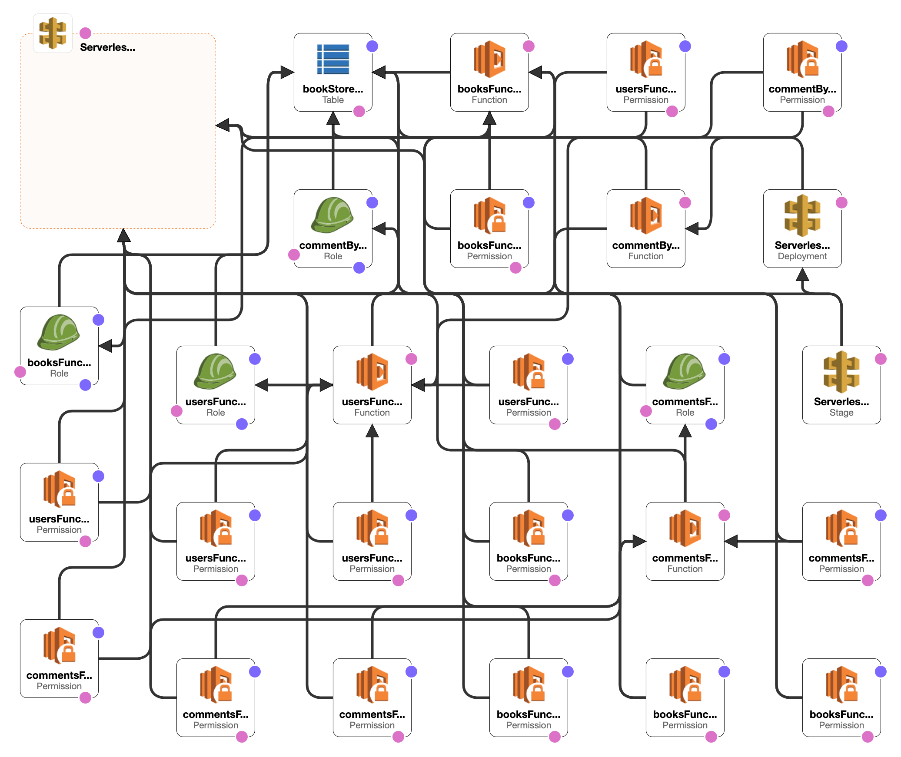
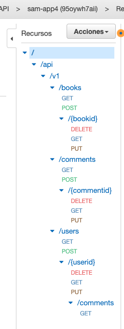
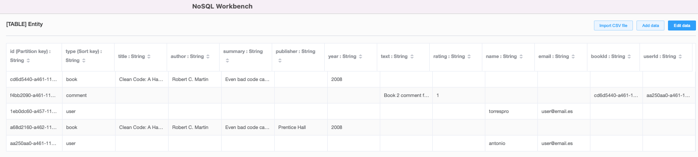

# Práctica 3. Serverless
## Enunciado
El objetivo de esta práctica consiste en implementar una API REST con las tecnologías serverless ofrecidas por AWS. En concreto, se utilizarán las siguientes:
 - API Gateway
 - Lambda
 - DynamoDB
 - SAM

La aplicación deberá ofrecer una una API REST que permitirá gestionar libros y revisiones
de libros:
El foro está formado por 3 entidades:
- Libros. Cada entrada contiene los siguientes campos: título, resumen, autor,
editorial y año de publicación. Cada libro tendrá una lista de comentarios.
- Comentarios. Usuario, texto y puntuación.
- Usuarios. Nombre y correo.

La aplicación ofrecerá los siguientes endpoints REST:
**Operaciones genéricas:**
- Creación, consulta, modificación y borrado de libros, comentarios y
usuarios. En estas operaciones se gestionará únicamente el recurso
(sin ningún tipo de relación).
**Operaciones especiales:**
- Obtener el listado de libros en el que se muestre únicamente el título
y el id.
- Obtener un único libro con los comentarios asociados. En los
comentarios deberá incluirse el nombre del usuario.
- Se deberá poder obtener los comentarios de un usuarios concreto. En
este caso los comentarios deberán incluir el id del libro al que
comentan.
**Restricciones:**
- No se podrán borrar usuarios con comentarios

## Solución

La plantilla de [Cloud Formation](template.yaml) de SAM contiene todo lo necesario para la creación de esta API Rest

Aquí el resultado:

Se han creado 5 funciones Lambda, una tabla en DynamoDB ([Single Table Design](https://aws.amazon.com/es/blogs/compute/creating-a-single-table-design-with-amazon-dynamodb/)) y una Amazon API Gateway para exponer la REST API: 

- _booksFunction_		    Lambda Function
- _usersFunction_	        Lambda Function
- _commentsFunction_	    Lambda Function
- _commentByIdFunction_   Lambda Function
- _userByIdFunction_   Lambda Function
- _bookStoreTable_ 		DynamoDB Table
- _ServerlessRestApi_ 	ApiGateway RestApi	

Se han creado algunas funciones con el patrón monolito (varios endpoints por función) y otras con un solo endpoint en cada función, single responsibility principle (SRP), siendo este último el recomendado por AWS (los ejemplos por defecto vienen con esa plantilla) y la [comunidad](https://medium.com/hackernoon/aws-lambda-should-you-have-few-monolithic-functions-or-many-single-purposed-functions-8c3872d4338f).

En las funciones con mas de un endpoint por HTTP Method se ha usado lógica basada en los parametros del path e.g:

    switch (event.httpMethod) {
        case 'GET':
            //api/v1/books
            if (!event.pathParameters){
                getAll(callback);
            }
            //api/v1/books/{bookid}
            else
            {
                getById(event.pathParameters.bookid, callback)
            }
            break;

Por esto y por motivos de mantenibilidad etc es preferible seguir el SRP y tener un endpoint por función.

### Rest API

### Single Table Design

Lo primero que viene a la base de datos es cómo almacenar la información básica para cada entidad, Libros, Comentarios y Usarios. En base de datos relacional, tendremos que crear 3 tablas, una para cada una. 
DynamoDB sugiere usar "Single Table" para almacenar nuestros datos tanto como podamos.
Vamos a crear una tabla de DynamoDB, llamada **entity**.
Al principio, debemos elegir una Partition Key y una Partition Key al crear la tabla. Dado que vamos a colocar todos los datos en una tabla, configuraremos id como Partition Key y _type_ como Sort Key.

      id: Tiene el identificador único para cada entidad guardada en la tabla.
      type: indica de qué se trata este elemento.
      p.ej.

Hay varias filas en esta tabla. La identificación significa una identificación única. El campo de tipo indica cuál es esta fila. Puede ser user, book, comment. Según los diferentes tipos, otros atributos podrían ser diferentes. Por ejemplo, el user tiene email pero book tiene title.
Si desea consultar los datos de un libro, podemos usar una consulta como:

      id = 001 y tipo = libro

#### One-to-many

La relación de uno a muchos es un modelo de datos típico que la mayoría de las aplicaciones necesitan admitir. Podemos usar una clave externa en la base de datos relacional para administrar la relación, pero ¿qué pasa con DynamoDB?

Esto trae un concepto importante GSI (Índice secundario global) cuando se usa DynamoDB. Las consultas en DynamoDB solo son compatibles con la Partition Key y la Partition Key. Al contrario de _Query_ , _Scan_ es una operación que puede usar para consultar cualquier campo de una tabla, pero debe evitar usarla tanto como pueda, ya que funciona como escanear todos los elementos en la memoria de su tabla sin mirar ningún índice. Puede ser útil en un trabajo de mantenimiento operativo, pero definitivamente no en una aplicación.
Para modelar la relación, crearemos dos campos adicionales en el comment, bookId y userId, como se muestra a continuación.

Con estos dos nuevos campos, podemos saber a qué libro pertenece un comentario, y que usuario hace el comentario. Pero la consulta aún no funciona sin un GSI adecuado.
A continuación, vamos a crear dos GSI más,
- **bookIdGsi**
`bookId` es la Partition Key y el tipo es la Sort Key.
- **userIdGsi**
`userId` es la Partition Key y el tipo es la Sort Key.
- 
A continuación, hablemos sobre el requisito de consultas que debemos admitir,

- Si desea consultar todos los comentarios realizados por un usuario, la consulta se puede realizar en userIdGsi `userId = 001 Y tipo = comentario`
- Si desea consultar todos los comentarios en un libro, entonces debemos mirar bookIdGsi:
`bookId = 002 Y tipo = comentario`

### Collection Postman para tests

[Postman collection](DynamoDB-Serverless.postman_collection.json)
